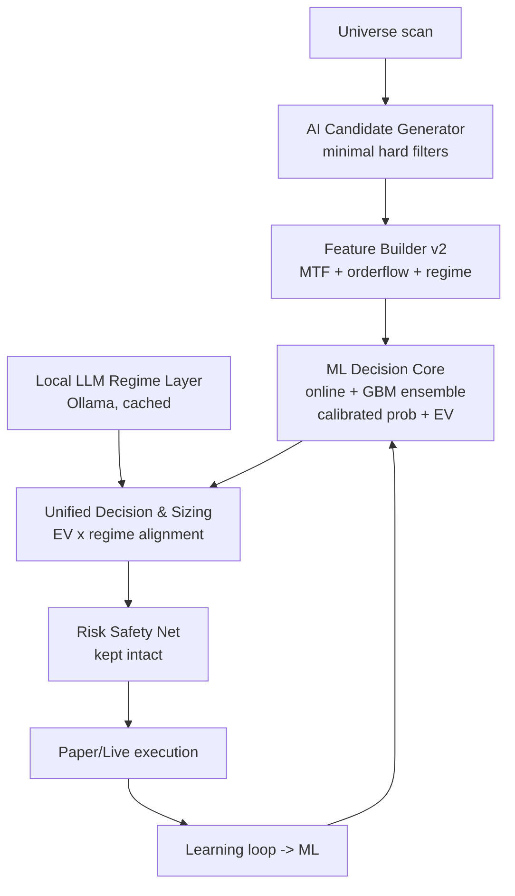

# AI-First Trading Bot Upgrade Plan v1.0.0

> **Version:** 1.0.0  
> **Project:** mexc-trading-bot-rust  
> **Goal:** Replace the multi-strategy stack with one unified AI-driven pipeline for higher win rates, running fully on localhost.

---

## Goal

Replace the current multi-strategy stack (`confluence`, `volume_pump`, `scalp`, `sniper`) with **one unified AI-driven strategy**:

- **Native Rust ML** — fast per-signal decision core (probability + expected R + sizing).
- **Local LLM (Ollama, fully offline on localhost)** — market-regime / context filter and directional bias.
- **Broad candidate generator** — replaces strict hand-tuned gates; those gates become *soft features* for the model.
- **Risk safety net is preserved** — kill switch, SL/TP, position sizing, daily loss limit, circuit breaker, per-symbol cooldown, max positions. Only over-restrictive *signal-generation* blockers are removed.

---

## Cursor Agent Models

Models available in the **Agent** model dropdown (enable in **Cursor Settings → Models** if missing):

| Model | Best for |
|-------|----------|
| **Fable 5** | Fast mechanical work — deletes, wiring, HTTP glue, UI |
| **Composer 2.5** | Fast multi-file edits, scaffolding |
| **Gemini 2.5 Flash** | Quick reads, simple tasks |
| **Claude 4.6 Sonnet** (thinking) | General reasoning, medium complexity |
| **Claude Sonnet 5** (thinking) | ML features, inference, backtest design |
| **Claude Opus 4.8** (thinking) | Hardest logic — decision layer, validation |
| **GPT-5.2 Codex** | Code-heavy Rust implementation |
| **GPT-5.3 Codex** | Code-heavy Rust + ML wiring |
| **GPT-5.5 Medium** | General reasoning, alternative to Sonnet |

Cursor does **not** auto-switch models per phase — pick from the dropdown before each new Agent chat.

---

## Phase Status

| Phase | Name | Recommended model | Alt model | Avg tokens | Status |
|-------|------|-------------------|-----------|------------|--------|
| 0 | Cleanup & scaffolding | Fable 5 | Composer 2.5 | ~120k | **Done** |
| 1 | AI candidate generator | Fable 5 | Composer 2.5 | ~150k–250k | **Done** |
| 2 | Feature engineering v2 | Claude Sonnet 5 | GPT-5.3 Codex | ~350k–550k | **Done** |
| 3 | ML decision core upgrade | Claude Sonnet 5 | GPT-5.3 Codex | ~400k–650k | **Done** |
| 4 | Local LLM regime layer (Ollama) | Fable 5 | Composer 2.5 | ~100k–200k | **Done** |
| 5 | Unified decision & sizing | Claude Opus 4.8 | Claude Sonnet 5 | ~300k–500k | **Done** |
| 6 | Backtest & win-rate validation | Claude Opus 4.8 | Claude Sonnet 5 | ~400k–700k | **Done** |
| 7 | UI & docs | Fable 5 | Composer 2.5 | ~150k–300k | **Done** |

**Project total (Phases 1–7 remaining):** ~1.85M–3.15M tokens  
**Full upgrade incl. Phase 0:** ~2.0M–3.3M tokens

> Estimates are per phase in a **single focused Agent chat**, including file reads, tool output, replies, and 1–2 `cargo check` fix rounds. Actual usage varies — check **Cursor Settings → Usage** after each session.

---

## Current State

- **Phase 0 complete:** Old engines removed (`confluence`, `pump`, `sniper`, `scalp`). `trading.mode` collapsed to `"ai"`. Reusable math kept in `indicators.rs`, `zones.rs`, `macro_filter.rs`.
- **Phase 1 complete:** `src/signals/ai_candidate.rs` emits long/short candidates from `process_tickers`, routed through ML/sentiment → `emit_signal`.
- **Phase 2 complete:** Features expanded from 20 → 33 dims (`src/ml/features.rs`): symbol HTF momentum, relative strength vs BTC, volatility-regime ratio, two order-flow proxies, funding rate, per-symbol sentiment, and 6 reserved LLM-regime slots (zeroed until Phase 4).
- **Phase 3 complete:** Online + ONNX blended into a maturity-weighted ensemble; fractional-Kelly sizing drives both risk % and leverage from realized win/loss R; offline retrain automation (`ml.auto_retrain_enabled`, off by default) hot-reloads a freshly exported ONNX model without a restart.
- **Phase 4 complete:** Local Ollama regime layer (`src/ai/llm_regime.rs`) classifies trending/chop/high-vol/risk-off + BTC bias + confidence every 5 min from macro-HTF + sentiment data; cached result fills ML feature slots 27–32. Neutral fallback when Ollama is offline — never blocks trading. `GET /llm/status` for observability.
- **Phase 5 complete:** `src/ai/decision.rs` is the single go/no-go authority — fuses ML win prob, expected value (R), regime alignment, and sentiment into approve/reject + conviction size/leverage, ahead of the preserved `RiskManager`. Collapses to a pure EV gate when the LLM is neutral. Wired into `route_enhanced_signal`.
- **Phase 6 complete:** `src/backtest/mod.rs` rebuilt on an R-based PnL model with profit factor / drawdown / expectancy; decision-pipeline replay + walk-forward + paper-acceptance gates. `POST /backtest/acceptance` is the mandatory pre-live check.
- **Phase 7 complete:** UI surfaces the whole AI pipeline — Signals tab shows per-signal EV (R), reward:risk, and decision reason; Dashboard + Training show the live LLM regime; Training shows ensemble blend / Kelly / auto-retrain and gained a one-click **Acceptance gate** check; Settings gained editable **LLM regime** and **Decision engine** sections; README rewritten for the AI-first stack. **All 7 phases done — upgrade v1.0.0 complete.**
- **ML today:** Online logistic regression (`src/ml/online.rs`) + optional GradientBoosting ONNX (`src/ml/onnx.rs`) blended into one ensemble probability, 33-dim features (`src/ml/features.rs`) incl. live LLM regime, fractional-Kelly sizing, continuous shadow-learning loop, optional scheduled offline retrain. Decision authority (`src/ai/decision.rs`) gates and sizes every trade.
- **Config:** `config/settings.yaml`, `src/config.rs`

---

## Target Architecture



---

## What Gets Removed vs Kept

### Remove (signal-gen blockers)

- `min_confluences`, confluence `require_*` flags, HTF hard-block
- Pump two-phase confirmation, `universe_rank_max` hard gate
- Alert-cooldown duplication, dead scalp/sniper paths
- Unused config (`require_ema_trend`, `max_exposure_pct`, etc.)

### Keep (safety)

- `RiskManager` open flow in `src/risk/manager.rs` (`can_open_position`, `can_open_symbol`, `record_trade_outcome`)
- SL/TP, sizing, `min_position_margin_usdt`, WS-stale execution guard
- Kill switch / circuit breaker (+ manual reset button)

### Repurpose

Old gate signals become numeric features feeding the model instead of hard rejects.

---

## Phases

### Phase 0 — Cleanup & scaffolding [Fable 5] — DONE

Mechanical removal + config collapse.

- [x] Retire `src/signals/confluence.rs`, `pump.rs`, `sniper.rs`, `scalp.rs`
- [x] Collapse `trading.mode` to single `ai` mode in `src/config.rs` and `active_strategies()`
- [x] Remove dead/unused config fields; simplify `config/settings.yaml`
- [x] Keep build green (`cargo check`)

---

### Phase 1 — AI candidate generator [Fable 5] — DONE

- [x] New `src/signals/ai_candidate.rs`: emits candidates with only *sanity* hard filters (price, liquidity, ATR via `risk/filters.rs`); dead-symbol move filter + per-symbol cooldown as rate limiters
- [x] Long AND short candidates with soft metrics attached (volume surge/z, momentum, zone score, structure, ATR) — informational, not gates
- [x] ATR-based SL, R-multiple TP ladder (`ai.tp_r_multiples`), configurable via new `ai:` config section
- [x] Wired into `process_tickers` → `process_ai_candidate` → ML/sentiment routing → `emit_signal`
- [x] 5 unit tests; `cargo check` + full test suite green (67 passed)

**Files:** `src/signals/ai_candidate.rs`, `src/scanner/mod.rs`, `src/config.rs` (`AiConfig`), `config/settings.yaml`

---

### Phase 2 — Feature engineering v2 [Claude Sonnet 5] — DONE

- [x] `FEATURE_DIM` bumped 20 → 33; existing indices 0–19 left byte-for-byte unchanged so legacy 10/15/20-dim ONNX exports keep working via truncation, and the `src/ml/online.rs` dimension-migration guard resets the online model cleanly on the new width
- [x] Multi-timeframe momentum: `symbol_htf_move_pct` (own HTF move) + `rel_strength_vs_btc` (vs BTC HTF move)
- [x] Volatility regime: `vol_regime_ratio` — current vs ~14-bars-ago ATR% (expansion/contraction)
- [x] Order-flow proxies (no aggressor-side data on MEXC klines, so proxied): `orderflow_body_ratio` (candle body/range pressure) + `orderflow_volume_imbalance` (up/down-bar volume skew)
- [x] Funding: `MexcClient::get_funding_rate`, polled per symbol every 10th `kline_refresh_loop` cycle (funding settles every few hours — no need for per-minute polling) into `SymbolState.funding_rate`, gated by `scanner.fetch_funding_rate`
- [x] Sentiment: added per-symbol `symbol_sentiment` alongside the existing `global_sentiment`
- [x] 6 reserved LLM-regime slots (`regime_trending/chop/high_vol/risk_off`, `llm_btc_bias`, `llm_confidence`) via new `MarketRegime` struct — all zero/false until Phase 4 wires the real classifier in, so no further dimension bump is needed then
- [x] `MlFeatureContext` moved to `src/ml/features.rs` (feature-context struct lives with the feature builder); `signal_features()` now takes `&MlFeatureContext` instead of loose args
- [x] `cargo check` (default + `--no-default-features`) and full test suite green (63 passed, incl. updated `signal_features_appends_context`)

**Files:** `src/ml/features.rs`, `src/ml/inference.rs`, `src/ml/mod.rs`, `src/scanner/mod.rs`, `src/exchange/mexc.rs`, `src/signals/state.rs`, `src/config.rs`, `config/settings.yaml`, `src/api/handlers.rs`

---

### Phase 3 — ML decision core upgrade [Claude Sonnet 5] — DONE

- [x] Online logistic + GradientBoosting ONNX blended into a calibrated ensemble in `predict()`: below `min_training_samples` behavior is unchanged (whichever model has data wins), but once **both** have data the blend weight ramps from mostly-ONNX to mostly-online as the online model matures past `3x min_training_samples` — the fast-adapting model earns trust gradually instead of a hard cutover
- [x] Fractional-Kelly sizing (`apply_kelly_sizing`, replaces the old linear proba-ramp `scale_risk_by_probability`): `kelly_full = p - (1-p)/(avg_win_r/avg_loss_r)` using the online model's realized R-multiple stats, scaled by new `ml.kelly_fraction` (default `0.5` = half-Kelly), then mapped into the existing `ml_risk_scale_min/max` safety envelope — drives **both** `suggested_risk_pct` and `suggested_leverage` now (higher-EV setups get more size *and* more leverage, low-EV ones shrink both to the floor)
- [x] EV-based decision is already the primary threshold authority via `effective_threshold()` / `online.auto_threshold()` (break-even probability from realized win/loss R) — Phase 3 extends it to gate the ensemble output, not just the online-only path
- [x] Automated offline retrain: new `ml.auto_retrain_enabled` (off by default), `retrain_interval_hours`, `retrain_min_new_samples`, `python_bin`, `export_script_path` config. New `retrain_loop` in `src/scanner/mod.rs` periodically shells out to `scripts/export_onnx.py` when enough new resolved signals have accumulated, then hot-reloads the result via `MlPipeline::reload_onnx()` — no restart needed. Fully best-effort: any failure (no Python, missing deps, too few samples) just logs a warning and the bot keeps trading on whatever it already had
- [x] `scripts/export_onnx.py` `FEATURE_DIM` bumped 15 → 33 to match Phase 2's feature vector
- [x] `learning_status()` now reports `"ensemble"` as `active_model` when both models have data, plus `ensemble_online_weight`, `kelly_fraction`, `avg_win_r`, `avg_loss_r`, `auto_retrain_enabled` for observability
- [x] 3 new unit tests (Kelly sizing scales strong vs. weak setups correctly, ensemble status reporting, safe reload against a missing ONNX file) + full suite green (66 passed), `cargo check` clean on both default and `--no-default-features`

**Files:** `src/ml/inference.rs`, `src/ml/online.rs`, `src/ml/mod.rs`, `src/ml/onnx.rs`, `src/scanner/mod.rs`, `src/config.rs`, `config/settings.yaml`, `scripts/export_onnx.py`

---

### Phase 4 — Local LLM regime layer (Ollama) [Fable 5] — DONE

- [x] New `src/ai/llm_regime.rs` (`LlmRegimeService`): HTTP client to local Ollama via `POST {base_url}/api/generate` with `format: "json"` + low temperature for deterministic structured output
- [x] Periodic cached classification: scanner's new `llm_regime_loop` runs every `llm.poll_interval_sec` (default 300s), assembling a compact snapshot (BTC/ETH HTF move %, BTC ATR%, global sentiment, Fear & Greed) via `build_regime_inputs()` from the existing macro-HTF cache and sentiment service — zero extra exchange calls
- [x] Output parsed tolerantly (`parse_regime_response`: finds the JSON object even inside prose, missing fields default to neutral, bias/confidence clamped) into the Phase 2 `MarketRegime` struct → feature slots 27–32 (`regime_trending/chop/high_vol/risk_off`, `llm_btc_bias`, `llm_confidence`) now carry live signal
- [x] Graceful fallback everywhere: Ollama offline/timeout/garbage ⇒ regime resets to neutral, one warning per outage (then debug-level), never blocks a trade; new `llm.enabled` toggle (default on) skips the loop entirely
- [x] Regime feeds `ml_feature_context()` (replacing the Phase 2 `Default::default()` placeholder) so every signal's ML features include the current regime; Phase 5's decision layer reads the same cached service
- [x] New `llm:` config section (`enabled`, `base_url` default `http://localhost:11434`, `model` default `llama3.2`, `poll_interval_sec`, `timeout_sec`) + `GET /llm/status` API endpoint (availability, consecutive failures, last raw reply, current regime)
- [x] 6 unit tests on prompt building + reply parsing (clean JSON, prose-wrapped, missing fields, clamping, garbage) — full suite 72/72 green, `cargo check` clean both feature sets, no new clippy warnings

**Files:** `src/ai/mod.rs`, `src/ai/llm_regime.rs`, `src/lib.rs`, `src/scanner/mod.rs`, `src/config.rs`, `config/settings.yaml`, `src/api/handlers.rs`, `src/api/mod.rs`

> **Setup:** install [Ollama](https://ollama.com) and run `ollama pull llama3.2` once. If it's not running, the bot logs one warning and trades on ML alone.

---

### Phase 5 — Unified decision & sizing [Claude Opus 4.8] — MOST CRITICAL — DONE

- [x] New `src/ai/decision.rs` (`DecisionEngine::decide`, a pure `(cfg, inputs) -> TradeDecision` fn — deterministic and side-effect free, which is what makes it unit-testable and reusable inside the Phase 6 backtest replay)
- [x] Single go/no-go authority fusing four inputs: ML win prob `p`, **expected value in R** (`EV = p*reward_risk - (1-p)`), **LLM regime alignment** (confidence-weighted `btc_bias` vs trade side + risk-off tilt), and **sentiment** (blended global + per-symbol, directional)
- [x] Hard gates: reject if `reward_risk < min_reward_risk`, if `EV < min_expected_value`, or if a *confident* regime strongly opposes the trade (`confidence >= regime_veto_confidence && alignment <= -regime_veto_alignment`)
- [x] Conviction sizing applied **on top of** the Phase 3 ML Kelly base: `size_scale` reacts to regime alignment (`regime_size_boost`), high-vol haircut, and directional sentiment, clamped to `[min_size_scale, max_size_scale]`; `leverage_scale` reacts at half-strength and is clamped tightly around 1.0 so a hot regime never balloons liquidation risk
- [x] Graceful degradation: with a neutral regime (Ollama offline ⇒ confidence 0, flags false) every regime term multiplies to zero, so the decision collapses to a pure EV / reward-risk gate on the ML edge — no hard dependency on the LLM
- [x] Wired into `scanner::route_enhanced_signal` (new `apply_decision` helper) between ML enrichment and the sentiment gate, then into the **preserved `RiskManager` safety net**. Rejected candidates become `decision_gate` shadow signals (so the model still learns); in paper-relax mode rejects are annotated but still traded for unbiased data collection
- [x] New signal fields `expected_value_r`, `reward_risk`, `decision_reason` (defaulted, in payload) for UI/backtest/observability; decision reasoning appended to the signal message
- [x] New `decision:` config section (`enabled`, `min_expected_value`, `min_reward_risk`, `regime_veto_confidence/alignment`, `regime_size_boost`, `high_vol_size_haircut`, `sentiment_size_weight`, `min/max_size_scale`)
- [x] 9 unit tests (EV approve/reject, reward-risk gate, confident-regime veto, aligned-regime boost, high-vol haircut, size clamp, short/bearish alignment)

**Files:** `src/ai/decision.rs`, `src/ai/mod.rs`, `src/scanner/mod.rs`, `src/signals/types.rs`, `src/config.rs`, `config/settings.yaml`

---

### Phase 6 — Backtest, walk-forward & win-rate validation [Claude Opus 4.8] — MANDATORY BEFORE LIVE — DONE

- [x] Rewrote `src/backtest/mod.rs` on a unified **R-based PnL model** (risk `risk_pct`/trade; win = `reward_risk * risk_pct`, stop = `-risk_pct`, expired = `-0.25R` time-stop, minus round-trip fees; equity compounds) shared across every entry point
- [x] Richer metrics everywhere: win rate, expectancy/trade, **profit factor**, avg win, avg loss, gross profit/loss, total return, **max drawdown**, equity curve
- [x] `Backtester::run_decision` — replays stored resolved signals through the **actual Phase 5 decision engine** (neutral/mock regime + zero sentiment for determinism), trading only approved signals and scaling each by the decision's `size_scale`, so the backtest mirrors live behavior
- [x] `StrategyLearner::walk_forward` extended: trains the online model on the first `train_frac`, then reports out-of-sample accuracy/precision **and** traded PnL metrics (win rate, expectancy, profit factor, max drawdown) for the trades the model would have taken
- [x] `acceptance_gate(metrics, cfg)` — the mandatory pre-live check: pass/fail per gate (`min_trades`, `min_win_rate`, `min_profit_factor`, `min_expectancy`, `max_drawdown`) with a human-readable summary of what failed. New `backtest:` acceptance config fields
- [x] `POST /backtest/acceptance` endpoint runs the decision-pipeline replay + acceptance gate and returns metrics + verdict + current `live_trading_enabled` — run this and confirm `passed: true` before enabling live
- [x] 7 unit tests (profit factor / win rate, ML-threshold filtering, decision-gate reject/trade, acceptance pass/fail, expired partial-loss) — full suite 88/88 green

**Files:** `src/backtest/mod.rs`, `src/config.rs`, `src/api/handlers.rs`, `src/api/mod.rs`, `config/settings.yaml`

> **Pre-live workflow:** let the bot collect resolved paper signals, then `POST /backtest/acceptance`. Only enable live once `acceptance.passed == true`.

---

### Phase 7 — UI & docs [Fable 5] — DONE

- [x] **Signals tab:** dropped the redundant Strategy column (single `ai` mode); added **EV (R)** and **R:R** columns from the Phase 5 decision fields (`expected_value_r`, `reward_risk`); hovering a row shows the full `decision_reason`. ML % column kept
- [x] **Dashboard:** the Fear & Greed card now shows the live **LLM regime** (`/llm/status`) — trending/chop/high-vol/risk-off + BTC bias + confidence, with a clear "Neutral (offline)" state when Ollama is down
- [x] **Training tab:** model card recognizes the `ensemble` active state; ML Gate card shows **ensemble blend** (online vs ONNX %), **Kelly fraction**, **realized avg win/loss R**, and the **auto ONNX retrain** toggle state; Market Sentiment card shows the regime + Ollama model tag
- [x] **Acceptance gate in the UI:** new "Acceptance gate" button (Training → Advanced diagnostics) calls `POST /backtest/acceptance` and renders a per-check pass/fail table (actual vs required) with a PASSED / NOT READY badge — the go-live checklist without curl
- [x] **Backtest / walk-forward renderers** updated for the Phase 6 metrics: profit factor, avg win/loss, gate label (decision engine vs ML threshold), and OOS traded-PnL block (win rate, return, profit factor, max drawdown)
- [x] **Settings screen:** new editable sections for **Local LLM Regime** (`llm.*`) and **Decision Engine** (`decision.*`) plus ML `kelly_fraction` / `auto_retrain_enabled` — wired through `src/user_settings.rs` (schema + values + apply) with live hot-reload like the rest
- [x] Header strategy label normalized ("AI"); `app.js` cache version bumped
- [x] **README.md rewritten** for the AI-first stack: pipeline walkthrough (features → ensemble → regime → decision → risk net), Ollama setup, validation/go-live workflow, updated tabs/API/project-layout/feature-status; stale MIGRATION.md reference removed
- [x] `cargo check` + full test suite green (88 passed), clippy clean, `node --check` on `app.js` clean

**Files:** `web/index.html`, `web/app.js`, `src/user_settings.rs`, `README.md`

---

## Critical Path

| Role | Phase |
|------|-------|
| Sets the ceiling on performance | Phase 2 (features) |
| Produces the edge signal | Phase 3 (ML core) |
| **Actually decides trades** | **Phase 5 (decision)** |
| Proves it works | Phase 6 (validation) |

**Priority order for reasoning-model time (Claude Sonnet 5 / Opus 4.8):**

1. Phase 5 — decision layer
2. Phase 2 + 3 — brain
3. Phase 6 — before trusting paper/live
4. Phase 1 — needed for live wiring (minimal stub OK first)
5. Phase 0, 4, 7 — execution and polish

---

## How to Run Each Phase in Cursor

**One phase = one Agent chat.** Pick the model from the dropdown before your first message.

### Model per phase

| Phase | Primary model | Alternative |
|-------|---------------|-------------|
| 0, 1, 4, 7 | **Fable 5** | Composer 2.5 |
| 2, 3 | **Claude Sonnet 5** | GPT-5.3 Codex |
| 5, 6 | **Claude Opus 4.8** | Claude Sonnet 5 |

### Starter prompts

**Fable 5 / Composer 2.5 phases (1, 4, 7):**

```
Implement Phase X from UPGRADE-v1.0.0.md.
Keep scope tight to this phase only. Run cargo check when done.
```

**Claude Sonnet 5 / GPT-5.3 Codex phases (2, 3):**

```
Design and implement Phase X from UPGRADE-v1.0.0.md.
This is ML/trading logic — reason carefully before editing.
Propose approach briefly, then implement. Run cargo check/tests.
```

**Claude Opus 4.8 phases (5, 6):**

```
Design and implement Phase X from UPGRADE-v1.0.0.md.
This is the core trading decision / validation layer — reason step by step before editing.
Propose approach briefly, then implement. Run cargo check/tests.
```

### Workflow tips

1. Start a **new Agent chat** per phase; attach `@UPGRADE-v1.0.0.md`
2. Use **Plan mode** first on Phases 2, 3, 5, 6 — then implement in Agent with the recommended model above
3. Mark phase done in the status table above after each phase
4. Run `cargo check` after every phase

---

## Token Budget Estimates (per model)

Cursor bills **total session usage**: your prompts, `@` file context, tool reads (e.g. `scanner/mod.rs` ~15k–25k per full read), agent replies, and follow-up fix rounds. Using **Fable 5** on Phases 2–6 does not save much — it reads the same files.

### Per phase — recommended model

| Phase | Recommended model | Typical range | Low (clean session) | High (many fix rounds) |
|-------|-------------------|---------------|---------------------|------------------------|
| 0 | Fable 5 | ~120k | 80k | 200k |
| 1 | Fable 5 | ~150k–250k | 100k | 350k |
| 2 | Claude Sonnet 5 | ~350k–550k | 250k | 700k |
| 3 | Claude Sonnet 5 | ~400k–650k | 300k | 900k |
| 4 | Fable 5 | ~100k–200k | 80k | 300k |
| 5 | Claude Opus 4.8 | ~300k–500k | 200k | 800k |
| 6 | Claude Opus 4.8 | ~400k–700k | 350k | 1.0M+ |
| 7 | Fable 5 | ~150k–300k | 100k | 450k |

### Per phase — if you use the wrong model

| Phase | With Fable 5 (not recommended for 2–6) | With Claude Opus 4.8 (overkill for 1, 4, 7) |
|-------|------------------------------------------|-----------------------------------------------|
| 1 | ~150k–250k ✓ | ~200k–350k |
| 2 | ~300k–500k ⚠ quality risk | ~350k–550k ✓ |
| 3 | ~350k–600k ⚠ quality risk | ~400k–650k ✓ |
| 4 | ~100k–200k ✓ | ~120k–300k |
| 5 | ~250k–500k ⚠ **do not** | ~300k–500k ✓ |
| 6 | ~350k–650k ⚠ quality risk | ~400k–700k ✓ |
| 7 | ~150k–300k ✓ | ~180k–400k |

### Budget by model (remaining work, Phases 1–7)

| Model | Phases | Estimated total |
|-------|--------|-----------------|
| **Fable 5** | 1, 4, 7 | ~400k–750k |
| **Claude Sonnet 5** | 2, 3 | ~750k–1.2M |
| **Claude Opus 4.8** | 5, 6 | ~700k–1.2M |
| **All phases** | 1–7 | ~1.85M–3.15M |

### What increases token usage

- Long single chat (history accumulates every turn)
- Re-reading `src/scanner/mod.rs` (~2k lines) multiple times
- Failed `cargo check` / test loops
- Bundling multiple phases in one session (e.g. Phase 1 + 5 together)
- Attaching the whole repo instead of `@UPGRADE-v1.0.0.md` + named files

### How to stay near the low end of each range

1. **One phase = one new Agent chat**
2. **Split heavy phases:** e.g. Phase 5 Chat A = `decision.rs` + tests; Chat B = scanner wiring only (~+50k overhead vs one bloated chat)
3. **Plan mode first** on Phases 2, 3, 5, 6 — short design, then implement (avoids wrong-path rewrites)
4. **Explicit scope:** “Phase X only. Do not read unrelated files.”
5. **Phase 5:** use **Claude Opus 4.8**; budget **~300k–500k**, not Fable 5

---

## Risks & Notes

- Ollama must be installed and a model pulled locally; bot degrades gracefully to ML-only if absent
- Removing gates increases trade frequency; ML threshold + risk net are the guardrails — **Phase 6 is mandatory before live**
- Keep `cargo check` / tests green per phase
- Old code can be reverted from git if needed

---

## Key File Map (post-upgrade)

```
src/signals/
├── ai_candidate.rs    ← Phase 1: broad candidate generator
├── indicators.rs      ← shared math (kept)
├── zones.rs           ← S/D zones (kept)
├── macro_filter.rs    ← BTC/ETH macro (kept)
├── state.rs
└── types.rs

src/ai/
├── decision.rs        ← Phase 5 done: unified trade authority (EV + regime + sentiment → go/no-go + sizing)
└── llm_regime.rs      ← Phase 4 done: Ollama regime layer (cached, neutral fallback)

src/ml/
├── features.rs        ← Phase 2 done: 33-dim feature vector + MlFeatureContext
├── inference.rs       ← Phase 3 done: online/ONNX ensemble + Kelly sizing + retrain hot-reload
├── online.rs          ← avg_win_r/avg_loss_r feed the Kelly formula
└── onnx.rs

src/backtest/mod.rs    ← Phase 6 done: R-based replay, decision-pipeline backtest, acceptance gates
src/scanner/mod.rs     ← orchestration (decision wired into route_enhanced_signal)
src/risk/manager.rs    ← safety net (unchanged)
config/settings.yaml
src/user_settings.rs        ← Phase 7 done: LLM + decision settings sections
web/index.html, web/app.js  ← Phase 7 done: EV/R:R/reason per signal, regime, acceptance gate UI
README.md                   ← Phase 7 done: rewritten for the AI-first stack
```
